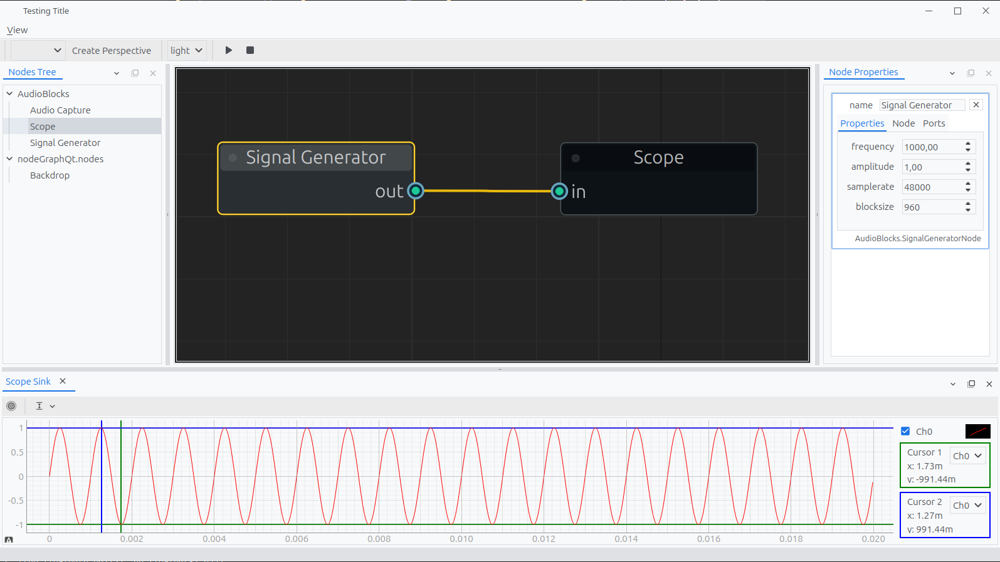

# Python Measurement Workbench

[](https://www.python.org/downloads/)
[](https://opensource.org/licenses/MIT)

A node-based desktop application for creating and running real-time measurement and signal processing graphs. Built with Python, PySide6, and a clean MVVM architecture.

## Overview

This project provides a flexible workbench environment where users can visually construct complex processing pipelines by connecting different functional blocks. It is designed to be a modular, testable, and maintainable platform for scientific and engineering applications.

### Features
* **Node-Based Graph Editor:** Visually create, connect, and configure processing blocks.
* **Real-Time Processing:** A backend processing engine designed to handle real-time data flow.
* **Extensible Architecture:** Easily add new custom blocks with unique logic and UI.
* **Dockable UI:** Flexible user interface powered by QtAds for a customizable workspace.
* **Clean MVVM Architecture:** A strong separation between backend logic (Models), UI presentation (Views), and the connecting logic (ViewModels).



## Getting Started

Follow these instructions to get a local development environment up and running.

### Prerequisites

* Python 3.12+
* Git

### Installation

1.  **Clone your forked repository:**
    ```bash
    git clone [https://github.com/Steve19802/workbench.git](https://github.com/Steve19802/workbench.git)
    cd workbench
    ```

2.  **Create and activate a virtual environment:**
    ```bash
    # For Linux/macOS
    python3 -m venv venv
    source venv/bin/activate

    # For Windows
    python -m venv venv
    .\venv\Scripts\activate
    ```

3.  **Install the required dependencies:**
    ```bash
    pip install -r requirements.txt
    ```

4.  **Install the workbench package in "editable" mode:**
    This is a crucial step. It links your source code to your Python environment, so any changes you make are immediately available without reinstalling.
    ```bash
    pip install -e .
    ```

5.  **Run the application:**
    ```bash
    python run_workbench.py
    ```

## Project Structure

The project follows a modern `src` layout and is organized by architectural layers to maintain a clean separation of concerns.

```
workbench/
├── src/
│   └── workbench/
│       ├── contracts/          # Data structures (Enums, etc.) shared between layers.
│       ├── core/               # The entire backend. Has NO UI dependencies.
│       │   ├── blocks/         # Specific backend Block implementations (the Models).
│       │   └── helpers/        # Helper logic for the backend (e.g., ScaleController).
│       │   └── processing_engine.py
│       ├── ui/                 # The entire frontend GUI.
│       │   ├── viewmodels/     # The "brains" of the UI (QObject-based).
│       │   └── views/          # The visual components (QWidget-based).
│       │       ├── nodes/      # Node-specific QWidget views.
│       │       └── widgets/    # Reusable custom widgets.
│       │   └── factory.py      # Creates and wires M-VM-V stacks.
│       └── utils/              # Generic, shared utility modules.
│
└── run_workbench.py            # The main application entry point.
```

## Architectural Overview

The application is built on a **Model-View-ViewModel (MVVM)** pattern.

* **Model (`core/blocks`):** The backend `Block` classes. They contain the pure processing logic and state. They are completely independent of the UI and communicate via `blinker` signals. The `ProcessingEngine` manages the graph of these models.
* **View (`ui/views`):** The frontend `QWidget` classes. These are "dumb" components responsible only for displaying information and capturing user input.
* **ViewModel (`ui/viewmodels`):** The bridge between the Model and the View. A ViewModel listens to signals from its Model, processes that data into a display-friendly format, and exposes it to the View. It also takes commands from the View and executes the appropriate logic on the Model.

## How to Add a New Block

Adding a new, fully functional block (e.g., a "Filter") involves creating three files and updating the factory.

#### Step 1: Create the Model (`core/blocks/filter_block.py`)

This is the backend logic. It inherits from `Block` and implements the core functionality.

```python
# src/workbench/core/blocks/filter_block.py
from ..block_base import Block

class FilterBlock(Block):
    def __init__(self, name: str):
        super().__init__(name)
        self.add_input_port("in")
        self.add_output_port("out")
        self._cutoff_freq = 1000.0 # An internal state property

    @property
    def cutoff_freq(self) -> float:
        return self._cutoff_freq

    @cutoff_freq.setter
    def cutoff_freq(self, value: float):
        self._cutoff_freq = value
        self.on_property_changed("cutoff_freq", value)

    def on_input_received(self, port_name: str, data):
        super().on_input_received(port_name, data)
        # --- Your filtering logic here ---
        # processed_data = apply_filter(data, self._cutoff_freq)
        # self.send_port_data("out", processed_data)
        pass
```

#### Step 2: Create the ViewModel (`ui/viewmodels/filter_viewmodel.py`)

This class acts as the bridge. For simple blocks, you can often reuse a generic `NodeViewModel`. For blocks with complex UI interactions, a custom ViewModel is needed.

```python
# src/workbench/ui/viewmodels/filter_viewmodel.py
from .node_viewmodel_base import NodeViewModel

class FilterViewModel(NodeViewModel):
    def __init__(self, model):
        super().__init__(model)
        # Add custom logic if needed
```

#### Step 3: Create the View (`ui/views/nodes/filter_node_view.py`)

This is the visual representation in `NodeGraphQt`. It inherits from `BaseNode`.

```python
# src/workbench/ui/views/nodes/filter_node_view.py
from NodeGraphQt import BaseNode

class FilterNodeView(BaseNode):
    __identifier__ = 'com.mycompany.Filter'
    NODE_NAME = 'Filter'

    def __init__(self):
        super().__init__()
        self._view_model = None
        self.add_input('in')
        self.add_output('out')

    def bind_view_model(self, view_model):
        self._view_model = view_model
        # Create UI properties from the model's properties
        self.create_property(
            "cutoff_freq",
            self._view_model.model.cutoff_freq,
            widget_type=...
        )
    
    def set_property(self, name, value):
        super().set_property(name, value)
        # Push property changes from the UI to the model
        setattr(self._view_model.model, name, value)
```

#### Step 4: Update the Factory (`ui/factory.py`)

Finally, teach the factory how to build and connect these three new components.

```python
# src/workbench/ui/factory.py
# --- Import the new classes ---
from workbench.core.blocks.filter_block import FilterBlock
from workbench.ui.viewmodels.filter_viewmodel import FilterViewModel
from workbench.ui.views.nodes.filter_node_view import FilterNodeView

class NodeFactory:
    def create_backend(self, identifier: str, **kwargs):
        # ...
        # --- Add a new case for your block ---
        elif identifier == 'com.mycompany.Filter':
            model = FilterBlock(name=kwargs.get("name", "Filter"))
            view_model = FilterViewModel(model)
            return model, view_model
        # ...
```
And remember to register the new node view in your `NodeEditor`: `self.graph.register_node(FilterNodeView)`.

## Contributing

Pull requests are welcome. For major changes, please open an issue first to discuss what you would like to change.

## License

[MIT](https://choosealicense.com/licenses/mit/)

